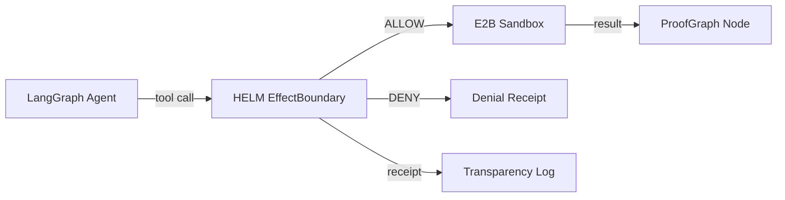
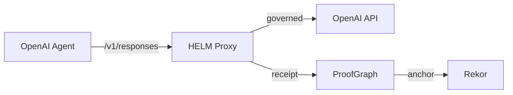
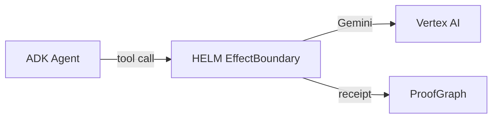
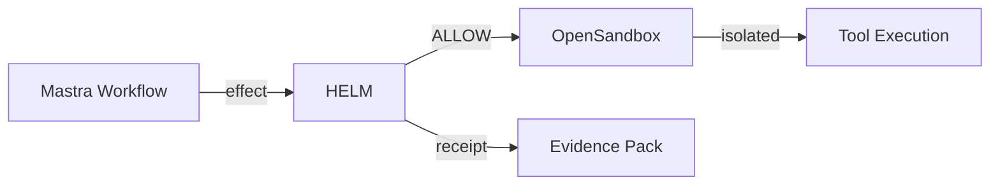
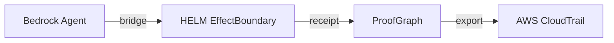

# HELM Reference Architecture Library

> Production-ready reference architectures for common deployment patterns.

## Architecture Index

### 1. HELM + LangGraph + E2B (Healthcare)



**Use case**: Governed medical data analysis with sandboxed execution.
**Jurisdiction**: US (HIPAA), EU (GDPR health data).
**Preset**: `healthcare-hipaa` + `engineering`.

```yaml
helm:
  pdp: in-process
  sandbox: e2b
  jurisdiction: us-baseline
  industry: healthcare-hipaa
  preset: engineering
langraph:
  adapter: helm-langgraph
  tool_wrapper: middleware
```

---

### 2. HELM + OpenAI Agents (Finance)



**Use case**: Governed financial analysis with audit trail.
**Jurisdiction**: US (SOX), EU (MiCA).
**Preset**: `finance` + `finance-sox`.

---

### 3. HELM + Google ADK (Enterprise)



**Use case**: Model-agnostic governance for Gemini-backed operations.
**Auth**: Google OAuth.
**Key point**: HELM provides model-agnostic authority — doesn't couple to Gemini.

---

### 4. HELM + Mastra + OpenSandbox (SaaS B2B)



**Use case**: Multi-tenant SaaS with tenant-isolated agent execution.
**Preset**: `saas-b2b`.

---

### 5. HELM + Bedrock AgentCore (Regulated)



**Use case**: Bridge for AWS-native regulated workloads.
**Pattern**: Evidence export to AWS-native audit tools.

---

## Deployment Patterns

### Pattern A: Sidecar Proxy

HELM runs as a sidecar container, intercepting all LLM traffic.

```yaml
deployment:
  mode: sidecar
  port: 4001
  upstream: ${LLM_API_URL}
```

### Pattern B: In-Process Library

HELM is embedded as a Go library in the application.

```go
import "helm.sh/core/pkg/guardian"
```

### Pattern C: Gateway

HELM runs as a shared gateway for multiple agents.

```yaml
deployment:
  mode: gateway
  port: 4001
  routes:
    - prefix: /v1/
      upstream: openai
    - prefix: /v2/
      upstream: anthropic
```

### Pattern D: MCP Server

HELM runs as an MCP server providing governance tools.

```json
{
  "mcpServers": {
    "helm": {
      "command": "helm",
      "args": ["mcp-server"]
    }
  }
}
```
